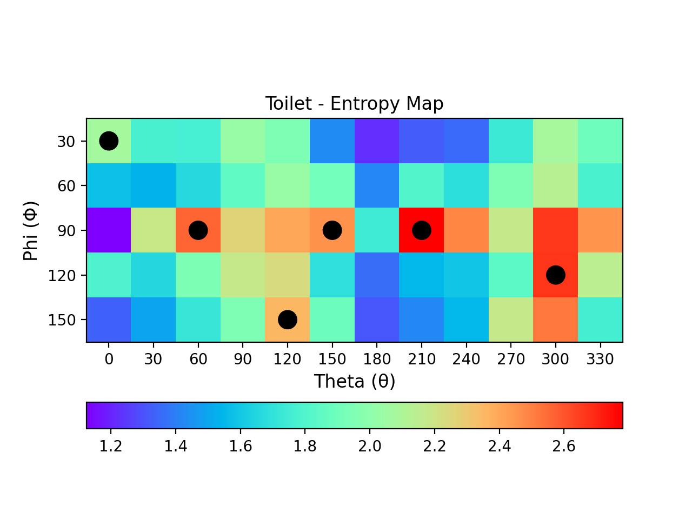
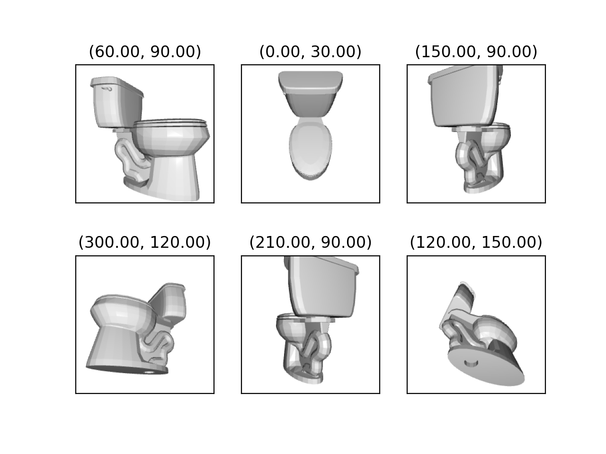

# Simultaneous Multi-View 3D Object Recognition and Grasp Pose Estimation


## Usage
### Data Preprocessing
Download and unzip the Modelet10 dataset from the official distribution:
http://3dvision.princeton.edu/projects/2014/3DShapeNets/ModelNet10.zip (451MB)

Ensure you are running Python>=3.6.5 and import the required libraries by running:
```
pip install -r requirements.txt
```

WARNING: The dataset is quite large and generation scripts may take 
hours to complete.

To generate the entropy dataset run:
```
python generate_entropy_dataset.py --modelnet10 <dir> --out <out>
```
substitute `<dir>` with the root directory of the ModelNet10 dataset.
This will save the entropy values for each of the 60 depth-views of 
each object in the dataset in the file `<out>/entropy_dataset.csv`.
You can change the `<out>` directory with the `--out` parameter.

To generate the view dataset run:
```
python generate_view_dataset.py --modelnet10 <dir> --set train --out <out>
python generate_view_dataset.py --modelnet10 <dir> --set test --out <out>
```
substitute `<dir>` with the root directory of the ModelNet10 dataset. 
The output will consist in the train and test set of the image-views
stored respectively in `<out>/view-dataset-train/image` and
`<out>/view-dataset-test/image`. You can change the `<out>` directory with the 
`--out` parameter.

The entropy model requires a pre-vozelized dataset which is generated 
by running:
```
python prevoxelization.py --modelnet10 <dir>
```
As usual substitute `<dir>` with the root directory of the ModelNet10 dataset.
The dataset will be generated in the `<out>/voxel_data` folder. You can change the 
`<out>` directory with the `--out` parameter.


### Models Training
The entropy model requires 50x50x50 occupancy grids in numpy format which 
are the results of `prevoxelization.py`, and to parse the entropy data 
from the `entropy_dataset.csv` file: 
```
python entropy_model.py --voxel_data <dir> --entropy_dataset <csv> --epochs <e> --batch_size <b> --out <out>
```
Substitute `<dir>` with `/voxel_data` and `<csv>` with 
`entropy-dataset/entropy_dataset.csv` (or with the output directory you choose).
You can select the number of epochs and the batch size by substituting the corresponding 
parameter.
The model with the best validation loss will be stored at 
`<out>/entropy-model/entropy_model.h5` alongside the logs of the training.

The classification model requires to be trained on the dataset `/view-dataset-train/image` generated,
using `/view-dataset-test/image` as validation data, generated with `generate_view_dataset.py`:
```
python single_view_cnn.py \
--train_data=view-dataset-train/image/ \
--test_data=view-dataset-test/image/ \
--batch_size=<b> \
--epochs=<e> \
--architecture=<arch> \
--train_sample_rate=1 \
--test_sample_rate=50 \
--lr=<lr>
```
Substitute `<b>`, `<e>` and `<lr>`with the batch size, the number of epochs 
and the learning rate to train the model.
The architecture can be specified by substituting `<arch>` with `vgg` or 
`mobilenetv2`.
The `train/test_sample_ratio` are parameters to train the model on a `1:r` 
subset of the full dataset.
Due to the large size of the dataset we suggest to reduce the validation 
data to a 1:50 ratio and to expect at least 1.5h per epoch of training time 
for a 1:1 train set. To achieve comparable results while reducing substantially 
training time use a higher subsampling ratio and increase the learning rate of at 
least an order of magnitude.

## Demo
Pre-trained models are available here: 

[entropy_model.h5](https://drive.google.com/file/d/1juaduoziJAoXCGPTfm3J7Q_Aq11sH3ln/view?usp=sharing)  
[classifier_model.h5](https://drive.google.com/file/d/1ai4ITvLGLkhN2By6wnXPoAkP_gTSazPU/view?usp=sharing)

A demonstration of the classification from a 3D mesh file can be run as following:
```
python demo.py --data <off_file> --entropy_model <e_model> --classifier_model <c_model>
```
Substitute `<off_file>` with an object from the ModelNet10 dataset, `<e_model>` with the
model trained with `entropy_model.py` and `<c_model>` with the model trained with `single_view_cnn.py`.
The demo will show the color coded entropy map extracted by the entropy model with 
black circles marking the selected best-views. Then it will render and plot the images
corresponding to the selected views. 
On terminal it will report the extracted views with their view-code [0 - 59] and it will
show the majority voting for class and pose.